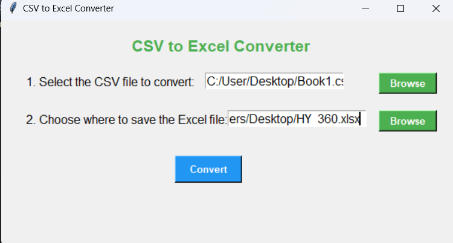

<h1>CSV to Excel Converter</h1>

This is a simple Python GUI application that allows you to convert CSV files to Excel format. The program uses the pandas library for data processing and tkinter for the graphical user interface.

<b>Features</b>
- User-friendly interface for selecting input and output files.
- Converts CSV files to Excel (.xlsx) format quickly.
- Error handling with descriptive messages for smooth operation.
- Cross-platform support (runs on Windows, macOS, and Linux).

